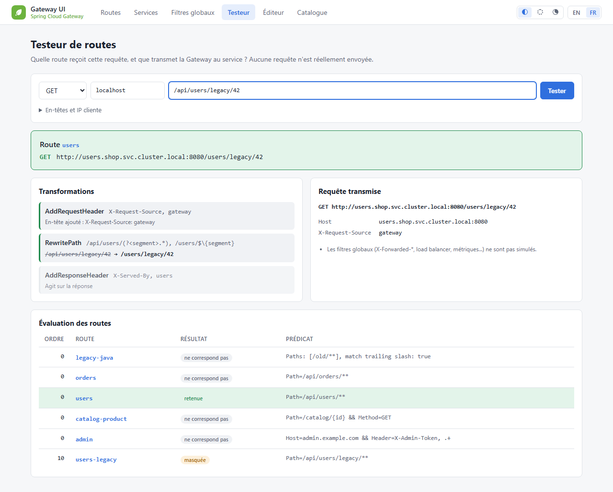
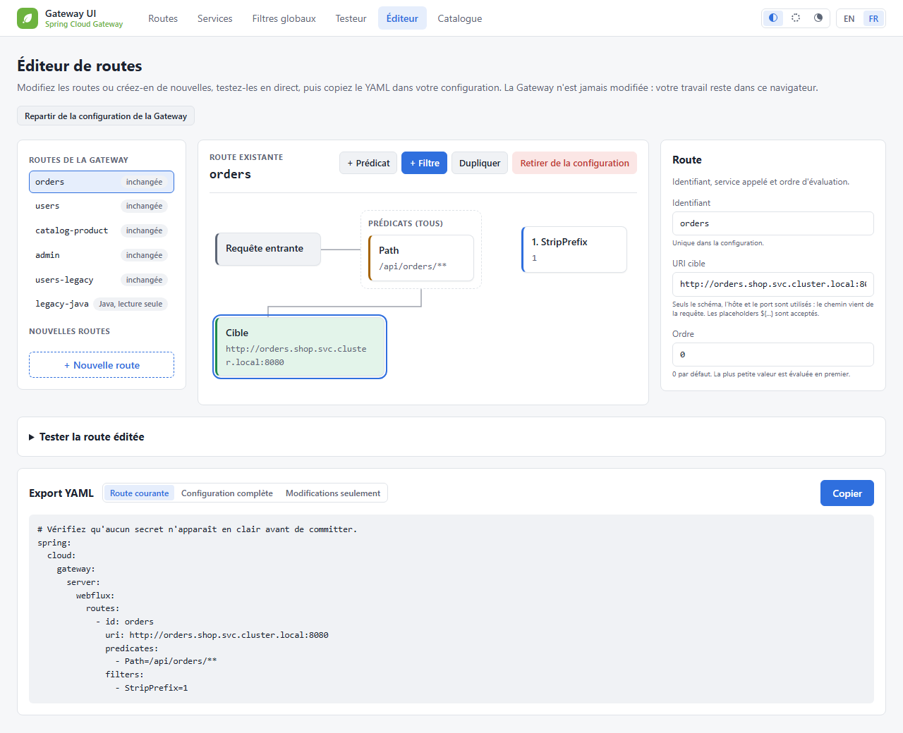
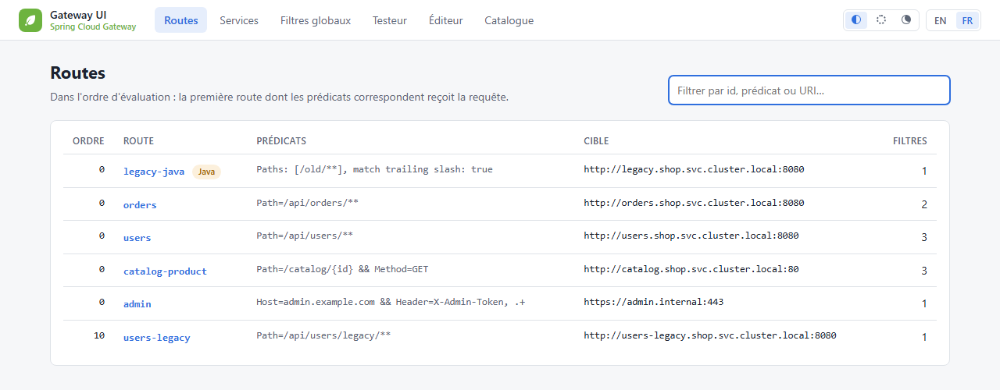
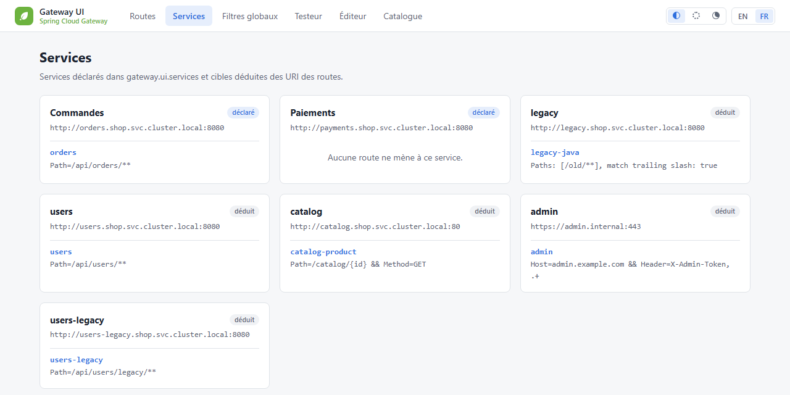
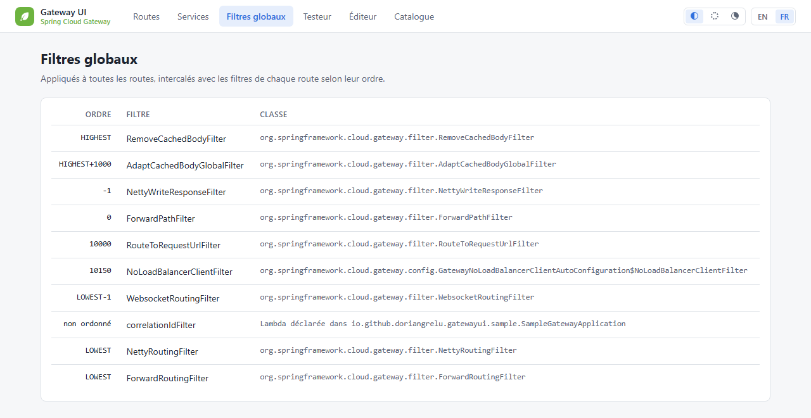
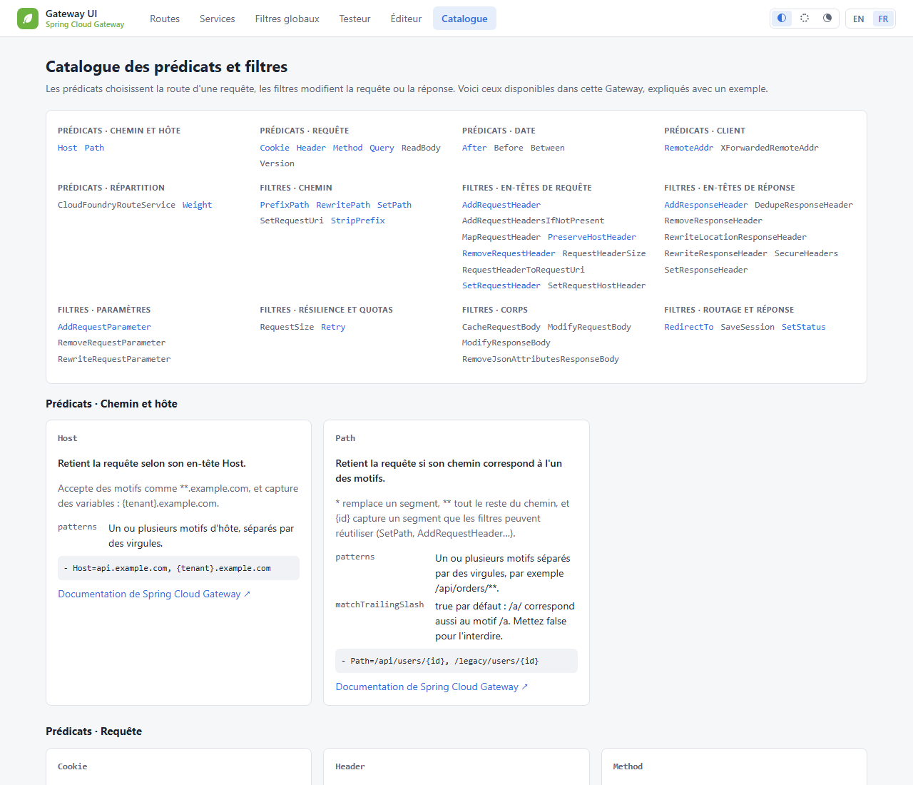

# Gateway UI

[](https://github.com/doriangrelu/spring-cloud-gateway-ui/actions/workflows/ci.yml)
[](https://central.sonatype.com/artifact/io.github.doriangrelu/gateway-ui-spring-boot-starter)
[](LICENSE)


Une UI embarquée dans votre **Spring Cloud Gateway (WebFlux)** pour voir, enfin, ce que fait votre Gateway : quelles routes existent, dans quel ordre elles sont évaluées, quels filtres s'exécutent, et surtout **quelle route prend une requête donnée et ce qui arrive au service**.

Un starter à ajouter, une propriété à activer, et l'UI est disponible sur `/gateway-ui`.

<picture>
  <source media="(prefers-color-scheme: dark)" srcset="docs/images/tester-dark.png">
  
</picture>

## Fonctionnalités

| Écran | Ce qu'on y voit |
|---|---|
| **Routes** | Toutes les routes dans l'ordre d'évaluation, avec une recherche instantanée sur l'id, les prédicats ou l'URI. |
| **Détail d'une route** | Le parcours d'une requête : prédicats → chaîne de filtres → cible. La chaîne mélange filtres globaux et filtres de route dans **l'ordre réel d'exécution**, calculé comme le fait la Gateway. |
| **Services** | Les routes regroupées par service cible, qu'il soit déclaré en configuration ou déduit des URI des routes. |
| **Filtres globaux** | L'ordre effectif de chaque filtre global. Les filtres sans ordre explicite sont signalés, par exemple un `@Order` posé sur une méthode `@Bean`, que la Gateway ignore. |
| **Testeur** | Pour une requête donnée (méthode, hôte, chemin, en-têtes, IP) : la route retenue, les routes **masquées** par une route prioritaire, le chemin réécrit étape par étape et la requête transmise au service. **Aucune requête n'est envoyée.** |
| **Éditeur** | Modifier les routes existantes ou en créer de nouvelles sur un canevas, avec l'aide du catalogue et des conseils (identifiant en double, regex invalide, `Path=/**`, secret en clair...). La route éditée se teste avec le même testeur, seule ou dans la configuration, puis s'exporte en YAML, placeholders `${...}` d'origine compris. **La Gateway n'est jamais modifiée** : le travail reste dans le navigateur. |
| **Catalogue** | Tous les prédicats et filtres disponibles dans votre Gateway, classés par catégorie, avec pour les plus courants une explication, la description de chaque argument et un exemple. Les filtres maison sont signalés. |

### Aperçu

#### Le parcours d'une requête dans une route

Requête entrante → prédicats → **toute la chaîne de filtres**, globaux et de route mélangés dans l'ordre où la Gateway les exécute réellement → cible. C'est la vue qui répond enfin à la question « mais dans quel ordre passent mes filtres ? ».

<picture>
  <source media="(prefers-color-scheme: dark)" srcset="docs/images/route-detail-dark.png">
  
</picture>

#### L'éditeur de routes

Les routes de la Gateway et les nouvelles routes, chacune avec son statut (inchangée, modifiée, nouvelle, retirée). On ajoute un prédicat ou un filtre depuis une palette de recherche, on le déplace dans la chaîne, et l'aide du catalogue s'affiche dans le panneau. Le testeur rejoue la route éditée exactement comme la Gateway la construirait. L'export YAML couvre la route courante, la configuration complète ou les seules modifications.

<picture>
  <source media="(prefers-color-scheme: dark)" srcset="docs/images/editor-dark.png">
  
</picture>

#### Les autres écrans

<details open>
<summary><strong>Routes</strong> : toutes les routes, dans l'ordre d'évaluation</summary>

<picture>
  <source media="(prefers-color-scheme: dark)" srcset="docs/images/routes-dark.png">
  
</picture>
</details>

<details>
<summary><strong>Services</strong> : services déclarés et déduits, avec leurs routes</summary>

<picture>
  <source media="(prefers-color-scheme: dark)" srcset="docs/images/services-dark.png">
  
</picture>
</details>

<details>
<summary><strong>Filtres globaux</strong> : ordre effectif et filtres non ordonnés</summary>

<picture>
  <source media="(prefers-color-scheme: dark)" srcset="docs/images/global-filters-dark.png">
  
</picture>
</details>

<details>
<summary><strong>Catalogue</strong> : prédicats et filtres expliqués, par catégorie</summary>

<picture>
  <source media="(prefers-color-scheme: dark)" srcset="docs/images/catalog-dark.png">
  
</picture>
</details>

Toutes ces captures ont été prises sur la [Gateway d'exemple](gateway-ui-sample). L'UI existe en anglais et en français, en thème clair et sombre. Par défaut, elle suit la langue du navigateur et le thème du système ; les sélecteurs de la barre de navigation (thème Auto / Clair / Sombre, langue **EN | FR**) permettent d'en changer, et le choix est mémorisé.

## Démarrage rapide

**Prérequis :** Java 25 et Spring Boot 4.0 avec Spring Cloud 2025.1 (Gateway Server WebFlux 5.0).

```xml
<dependency>
    <groupId>io.github.doriangrelu</groupId>
    <artifactId>gateway-ui-spring-boot-starter</artifactId>
    <version><!-- dernière version --></version>
</dependency>
```

```yaml
gateway:
  ui:
    enabled: true
```

Ouvrez ensuite `http://<votre-gateway>/gateway-ui`.

## Configuration

| Propriété | Défaut | Description |
|---|---|---|
| `gateway.ui.enabled` | `false` | Active l'UI. Désactivée, l'UI ne crée aucun bean et n'expose aucune URL. |
| `gateway.ui.base-path` | `/gateway-ui` | Préfixe des pages et ressources de l'UI. La racine `/` est refusée. |
| `gateway.ui.discover-services` | `true` | Déduit les services cibles à partir des URI des routes. |
| `gateway.ui.default-locale` | `en` | Langue de l'UI (`en` ou `fr`) quand l'utilisateur n'en a pas choisi une dans l'UI et que celle de son navigateur n'est pas supportée. |
| `gateway.ui.services.<nom>.url` | | URL du service. Les routes qui pointent vers le même schéma, hôte et port lui sont rattachées. |
| `gateway.ui.services.<nom>.display-name` | `<nom>` | Libellé affiché. |
| `gateway.ui.services.<nom>.route-ids` | | Routes rattachées explicitement au service. |

```yaml
gateway:
  ui:
    enabled: true
    services:
      orders:
        url: http://orders.shop.svc.cluster.local:8080
        display-name: Commandes
      payments:
        url: http://payments.shop.svc.cluster.local:8080
        route-ids: [ payments-v1, payments-v2 ]
```

## En production

L'UI expose la topologie interne de la Gateway (hôtes, filtres, en-têtes). Elle est donc **désactivée par défaut**, et sa protection relève de votre application ([ADR 0010](docs/adr/0010-securiser-l-acces-a-l-ui.md)) : ses URL sont de simples routes WebFlux sous `gateway.ui.base-path`, que Spring Security protège comme n'importe quel endpoint. Si l'UI est activée sans Spring Security sur le classpath, un avertissement est journalisé au démarrage.

### Option 1 : ne l'activer qu'hors production

```yaml
# application-dev.yml (et application-recette.yml)
gateway:
  ui:
    enabled: true
```

### Option 2 : exiger un rôle (Spring Security)

```java
@Bean
SecurityWebFilterChain security(ServerHttpSecurity http) {
    return http
            .authorizeExchange(exchanges -> exchanges
                    .pathMatchers("/gateway-ui/**").hasRole("OPS")
                    .anyExchange().permitAll())
            .httpBasic(Customizer.withDefaults())
            .build();
}
```

### Option 3 : connexion OAuth2 / OpenID Connect (Keycloak)

Avec Spring Security et son client OAuth2 sur le classpath, une chaîne dédiée à l'UI, évaluée en premier, impose une connexion par Keycloak sans toucher aux autres routes de la Gateway :

```yaml
spring:
  security:
    oauth2:
      client:
        registration:
          keycloak:
            client-id: gateway-ui
            client-secret: ${GATEWAY_UI_CLIENT_SECRET}
            scope: openid
        provider:
          keycloak:
            issuer-uri: https://keycloak.example.com/realms/platform
```

```java
@Bean
@Order(Ordered.HIGHEST_PRECEDENCE)
SecurityWebFilterChain gatewayUiSecurity(ServerHttpSecurity http) {
    return http
            // L'UI, plus les URL de la connexion OAuth2 (redirection et retour de Keycloak)
            .securityMatcher(ServerWebExchangeMatchers.pathMatchers(
                    "/gateway-ui/**", "/oauth2/authorization/**", "/login/oauth2/code/**"))
            .authorizeExchange(exchanges -> exchanges.anyExchange().authenticated())
            .oauth2Login(Customizer.withDefaults())
            .build();
}
```

Le client `gateway-ui` doit déclarer `https://<votre-gateway>/login/oauth2/code/keycloak` comme URL de redirection. Pour exiger un rôle Keycloak précis plutôt qu'une simple connexion, convertissez les rôles du jeton en autorités (`GrantedAuthoritiesMapper`), puis remplacez `authenticated()` par `hasRole(...)`.

### Ce que l'UI garantit de son côté

- Elle est en **lecture seule** : elle ne modifie pas les routes et n'appelle jamais les services. L'éditeur produit du YAML à reporter dans votre configuration ; son travail reste dans le navigateur, et ses appels POST sont compatibles avec la protection CSRF de Spring Security.
- Ses réponses portent des en-têtes de sécurité stricts (`Content-Security-Policy` limitée aux ressources de l'UI, interdiction d'intégration dans une frame, etc.). Ils ne s'appliquent qu'aux pages de l'UI, jamais aux routes de votre Gateway.

## Compatibilité

| Gateway UI | Java | Spring Boot | Spring Cloud | Gateway |
|---|---|---|---|---|
| 0.1.x | 25+ | 4.0.x | 2025.1.x | Server WebFlux 5.0.x |
| 1.0.x | 25+ | 4.0.x | 2025.1.x | Server WebFlux 5.0.x |

La variante **Server WebMVC** de Spring Cloud Gateway n'est pas encore supportée : elle est prévue pour la 1.1.0 (voir la [roadmap](docs/roadmap.md)).

### Ce qui est garanti

À partir de la 1.0.0, le projet suit le [versionnage sémantique](https://semver.org/lang/fr/) sur son API publique ([ADR 0008](docs/adr/0008-api-publique-et-compatibilite.md)) :

- les coordonnées du starter ;
- les propriétés `gateway.ui.*` : noms, types et sens des valeurs par défaut ;
- `GatewayUiProperties` et le nom de `GatewayUiAutoConfiguration` ;
- les URL des pages de l'UI, y compris les paramètres du testeur.

Une propriété est d'abord dépréciée dans une version mineure, puis supprimée à la version majeure suivante.

Les classes des paquets `io.github.doriangrelu.gatewayui.internal.*`, les beans de l'UI, les templates et les ressources, ainsi que l'API JSON de l'éditeur (`{base-path}/api/editor`), sont des détails d'implémentation, sans garantie de compatibilité.

Chaque ligne mineure supporte une génération de Spring Cloud et la génération de Spring Boot associée. Passer à une nouvelle génération donne une nouvelle version mineure, signalée dans le changelog et dans le tableau ci-dessus.

## Modules

| Module | Rôle |
|---|---|
| [`gateway-ui-spring-boot-starter`](gateway-ui-spring-boot-starter) | La dépendance à ajouter dans votre Gateway. |
| [`gateway-ui-autoconfigure`](gateway-ui-autoconfigure) | Code, templates et auto-configuration. Son README décrit l'architecture. |
| [`gateway-ui-sample`](gateway-ui-sample) | Gateway d'exemple pour essayer l'UI en local. Non publiée. |

## Essayer en local

```bash
./mvnw install -DskipTests
```

```bash
./mvnw -f gateway-ui-sample/pom.xml spring-boot:run
```

L'UI est alors sur http://localhost:8080/gateway-ui.

## Contribuer

Les contributions sont bienvenues. Les règles de code, le build et le processus de PR sont décrits dans [CONTRIBUTING.md](CONTRIBUTING.md), les évolutions dans [CHANGELOG.md](CHANGELOG.md) et la publication dans [RELEASING.md](RELEASING.md).

## Licence

Distribué sous [licence Apache 2.0](LICENSE).

Spring, Spring Boot et Spring Cloud sont des marques de Broadcom Inc. et/ou de ses filiales. Ce projet est indépendant : il n'est ni affilié à Broadcom ni approuvé par Broadcom.
