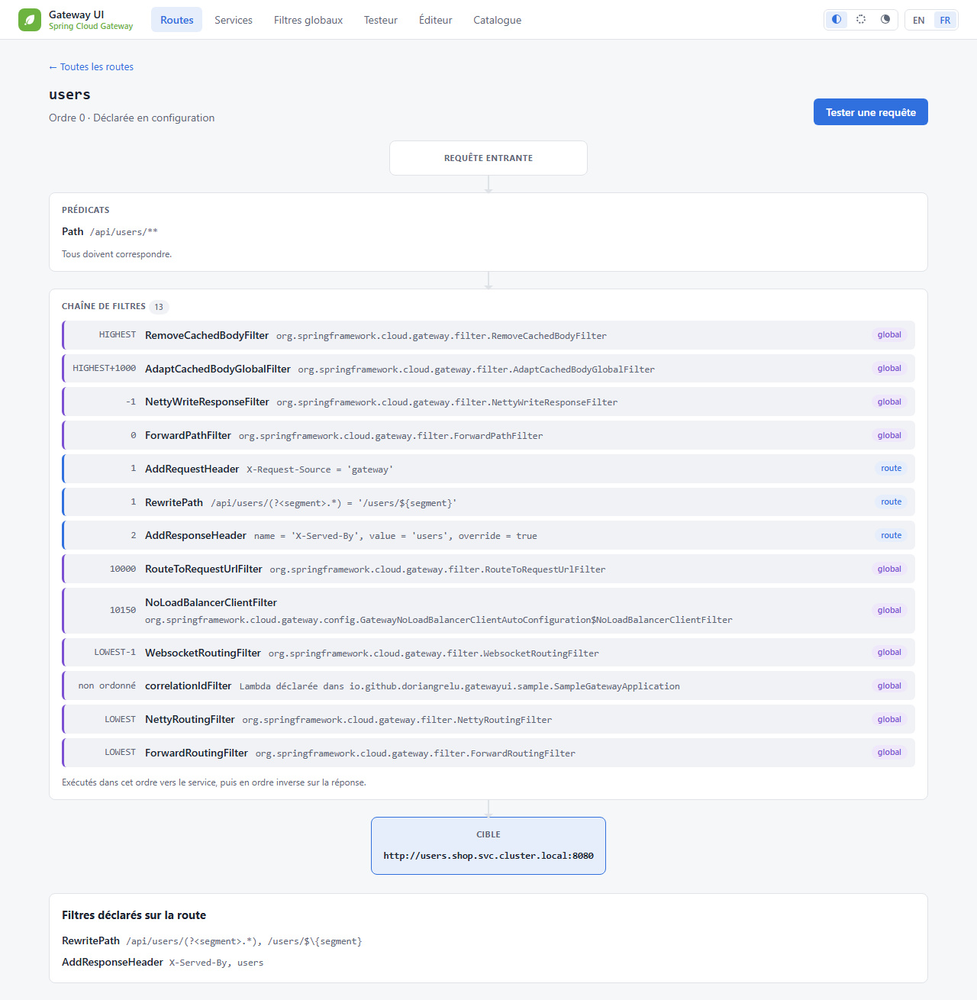

# gateway-ui-autoconfigure

Tout le code de l'UI : auto-configuration, introspection de la Gateway, testeur de routes, pages et ressources. Pour l'utiliser, passez par le [starter](../gateway-ui-spring-boot-starter) ; ce README s'adresse à ceux qui veulent comprendre ou faire évoluer le module.

## Architecture

```
io.github.doriangrelu.gatewayui
├── autoconfigure       GatewayUiAutoConfiguration, GatewayUiProperties (gateway.ui.*) : API publique
└── internal            implémentation, sans garantie de compatibilité (ADR 0008)
    ├── i18n            messages FR/EN de l'UI
    ├── inspect         lecture de la Gateway : routes, définitions, filtres, services
    ├── tester          testeur de routes : échange fictif + simulation des filtres
    ├── editor          éditeur graphique : modèle d'édition, YAML, conseils, simulation de la route éditée, catalogue
    └── web             routes WebFlux, handlers des pages et de l'API de l'éditeur, rendu JTE
src/main/jte        templates des pages (précompilés au build)
src/main/resources  CSS et scripts de l'éditeur (assets/), messages, déclaration de l'auto-configuration
```

Les dépendances vont dans un seul sens : `web` → `editor` → `tester` → `inspect` → API de Spring Cloud Gateway. `inspect`, `tester` et `editor` ne connaissent ni HTTP ni les templates.

### `autoconfigure`

`GatewayUiAutoConfiguration` ne s'active que si **toutes** les conditions suivantes sont réunies :

| Condition | Pourquoi |
|---|---|
| `gateway.ui.enabled=true` | L'UI est désactivée par défaut, pour ne jamais être exposée par accident. |
| Application web réactive | L'UI repose sur WebFlux. |
| `RouteLocator` et `RouteDefinitionLocator` présents | Il faut une Gateway Server WebFlux à inspecter. |

Les beans déclarés par l'auto-configuration sont des détails d'implémentation : ils ne sont pas prévus pour être remplacés. L'API publique se limite au starter, aux propriétés `gateway.ui.*`, à `GatewayUiProperties`, au nom de `GatewayUiAutoConfiguration` et aux URL des pages ([ADR 0008](../docs/adr/0008-api-publique-et-compatibilite.md)).

### `inspect`

| Classe | Rôle |
|---|---|
| `GatewayInspector` | Point d'entrée en lecture seule. Lit les routes à chaque appel depuis le `RouteLocator` de la Gateway, qui les met en cache : un rafraîchissement des routes est visible sans redémarrage. |
| `RouteView` | Vue d'une route. Les prédicats et filtres **déclarés** (`Definition`) n'existent que pour les routes issues d'une `RouteDefinition` (YAML, properties) ; une route Java DSL n'a que la description textuelle fournie par la Gateway. |
| `FilterStep` | Un filtre de la chaîne. `GatewayInspector.pipeline()` reproduit le tri de `FilteringWebHandler` : filtres globaux puis filtres de route, triés de façon stable par ordre. |
| `ServiceCatalog` | Regroupe les routes par `scheme://host:port`, en combinant les services déclarés et ceux déduits des routes. |

Voici le résultat de `pipeline()` affiché sur la page de détail d'une route. Les filtres globaux (en violet) et les filtres de route (en bleu) y sont intercalés selon leur ordre :

<picture>
  <source media="(prefers-color-scheme: dark)" srcset="../docs/images/route-detail-dark.png">
  
</picture>

### `tester`

Le testeur n'envoie **jamais** de requête.

1. `RouteTester` crée un `SimulatedExchange` : une requête au corps vide, avec les en-têtes, l'hôte et l'IP saisis.
2. Il évalue le prédicat de **chaque** route sur cet échange, comme `RoutePredicateHandlerMapping`. La première route qui correspond est retenue, les suivantes sont signalées comme masquées.
3. `FilterSimulator` rejoue les filtres de la route retenue. L'ordre vient de la route effective, les arguments de sa déclaration (`default-filters` puis filtres de la route).
4. Chaque filtre connu est rejoué par `FilterEffects`, qui reproduit l'algorithme de la fabrique de filtres de Spring Cloud Gateway.

| Filtres rejoués | Effet simulé |
|---|---|
| `StripPrefix`, `PrefixPath`, `RewritePath`, `SetPath` | Chemin (avec les variables extraites par `Path=/users/{id}`) |
| `AddRequestHeader`, `SetRequestHeader`, `RemoveRequestHeader` | En-têtes |
| `AddRequestParameter` | Query string |
| `SetRequestHostHeader`, `PreserveHostHeader` | En-tête `Host` transmis |

Les filtres qui n'agissent que sur la réponse sont signalés comme tels. Tous les autres filtres sont listés comme « non simulés », sans être exécutés. Cela couvre les filtres personnalisés, les filtres des routes Java DSL, ainsi que `RequestRateLimiter`, `CircuitBreaker`, etc.

**Ajouter un filtre simulé** : écrire une méthode `(Definition, SimulationState) -> String` dans `FilterEffects`, puis l'enregistrer dans la map `EFFECTS`. Elle doit reproduire fidèlement la fabrique de la Gateway et être couverte par un test.

### `editor`

L'éditeur graphique ([ADR 0011](../docs/adr/0011-technique-de-l-editeur.md) à [0013](../docs/adr/0013-catalogue-documente.md)). Toute la logique est en Java ; les scripts de la page se limitent à l'affichage et à l'espace de travail, conservé dans le navigateur.

| Classe | Rôle |
|---|---|
| `EditorService` | Point d'entrée de l'API de l'éditeur (`{base-path}/api/editor`). |
| `EditableRoutes`, `RawRouteConfiguration` | Convertissent les définitions de la Gateway en routes éditables, et rétablissent les placeholders `${...}` à partir des valeurs brutes de la configuration Spring. |
| `RouteYaml` | Génère le YAML, en forme raccourcie, en écrivant `$\{` tout `${` littéral, pour que Spring ne le prenne pas pour un placeholder. |
| `EditedRouteSimulator` | Construit la route éditée (et, en mode « dans la configuration », les autres routes) avec le `RouteDefinitionRouteLocator` de la Gateway, ses vraies fabriques et ses `default-filters`, puis la passe au testeur. Rien n'est ajouté à la Gateway. |
| `RouteAdvisor`, `SecretDetector` | Conseils sur la route éditée : erreurs (identifiant, URI, argument obligatoire, regex) et avertissements (route sans prédicat, `Path=/**`, secret en clair). |
| `Catalog` | Catalogue des fabriques : catégorie, champs, lien vers la documentation officielle, détection des fabriques maison. Les textes sont dans les fichiers de messages (`catalog.predicate.<Nom>.*`, `catalog.filter.<Nom>.*`). |

### `web`

- **Routage** : `GatewayUiRouter` sert les pages **et** les ressources statiques via une `RouterFunction`. Son mapping est prioritaire sur celui de la Gateway, alors que le handler de ressources statiques de Spring Boot passe après. Une route `Path=/**` masquerait sinon le CSS et le JavaScript (un test le vérifie).
- **Pages** : `GatewayUiHandler` rend une page complète, ou seulement le fragment à remplacer quand la requête vient de htmx (en-tête `HX-Request`). Chaque écran garde ainsi une URL partageable.
- **Templates** : `TemplateRenderer` utilise des templates JTE précompilés dans un paquet dédié (`io.github.doriangrelu.gatewayui.internal.jte`). Il n'enregistre aucun `ViewResolver`, n'embarque aucun compilateur et n'interfère pas avec le rendu de l'application hôte.
- **Éditeur** : `EditorApiHandler` sert l'API JSON de l'éditeur. La page fournit aux scripts leurs textes traduits et, si Spring Security protège l'application contre le CSRF, le jeton que les appels POST renvoient (`CsrfToken`, lu sans dépendre de Spring Security).
- **htmx** : le script est servi depuis le webjar `org.webjars.npm:htmx.org`. Sa version est lue dans le webjar lui-même, pour ne pas la dupliquer.

### `i18n`

Les textes de l'UI sont dans `src/main/resources/io/github/doriangrelu/gatewayui/internal/i18n/messages_en.properties` et `messages_fr.properties` ([ADR 0009](../docs/adr/0009-internationalisation.md)). Ils sont lus par la classe `Messages`, propre à l'UI : le `MessageSource` de l'application hôte n'est jamais utilisé.

- `inspect` et `tester` ne produisent pas de texte mais des `Message` (clé et arguments), traduits au rendu.
- La langue est choisie par `UiLocaleResolver` : sélecteur de l'UI (paramètre `lang`, mémorisé dans le cookie `gateway-ui-lang`), puis `Accept-Language`, puis `gateway.ui.default-locale`.
- `MessagesTest` vérifie que les deux fichiers ont exactement les mêmes clés.

## Templates et style

- Les templates sont dans `src/main/jte` : `layout.jte` porte la structure commune, les autres fichiers correspondent aux pages et aux fragments htmx (`routesTable`, `testerResult`). `testerResult` est aussi rendu par l'API de l'éditeur, pour afficher le même résultat que le Testeur.
- Les scripts de l'éditeur sont des modules JavaScript natifs, sans build ni dépendance, dans `assets/editor/`.
- Le CSS est dans `src/main/resources/io/github/doriangrelu/gatewayui/assets/gateway-ui.css`. Les couleurs sont des variables CSS, redéfinies pour le thème sombre (`prefers-color-scheme`).
- Le plugin `jte-maven-plugin` compile les templates pendant `generate-sources`. Une erreur de template est donc une erreur de compilation.

## Tests

| Test | Couverture |
|---|---|
| `GatewayUiIntegrationTest` | Gateway complète avec des routes déclarées (dont une route attrape-tout), parcourue via `WebTestClient` : pages, fragments htmx, testeur, services et ressources. La Gateway de test est commune (`GatewayUiIntegrationTestSupport`). |
| `GatewayUiEditorIntegrationTest`, `GatewayUiCatalogIntegrationTest` | API et page de l'éditeur, catalogue, et cohérence des textes du catalogue avec les fabriques réelles. |
| `GatewayUiCsrfIntegrationTest` | Appels POST de l'éditeur avec la protection CSRF de Spring Security. |
| `GatewayUiAutoConfigurationTest` | Conditions d'activation. |
| Tests unitaires de `inspect`, `tester` et `editor` | Arguments déclarés, ordres, regroupement des services, simulation des filtres, saisie du testeur, modèle d'édition, YAML, conseils, catalogue. |

```bash
../mvnw -pl gateway-ui-autoconfigure verify
```
